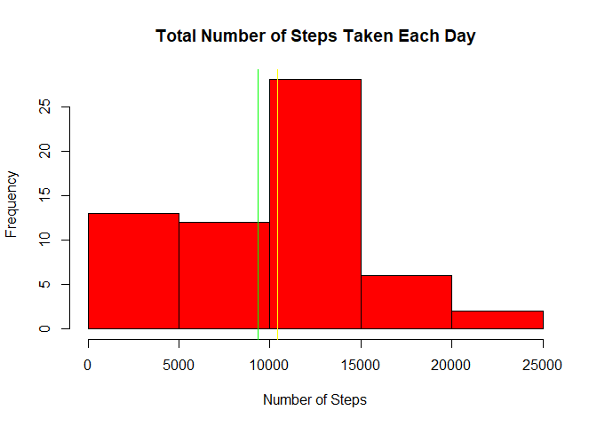
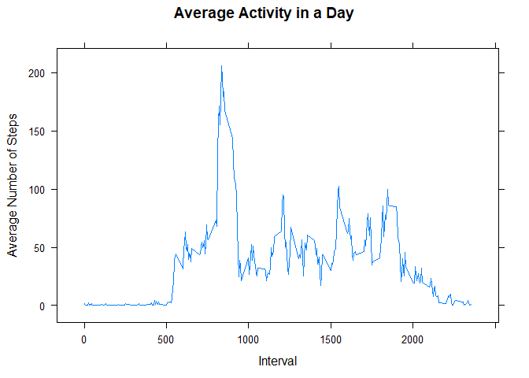
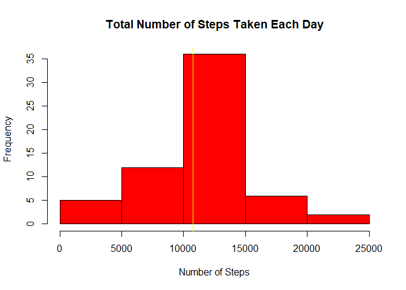
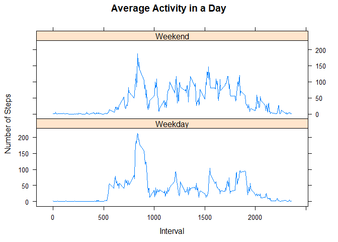

fig.path='figure/'

## Loading and preprocessing the data

```r
unzip("~/RepData_PeerAssessment1/activity.zip", "activity.csv")
activity <- read.csv("activity.csv")
activity[,2] <- as.Date(strptime(activity[,2], "%Y - %m - %d"))
```

## What is mean total number of steps taken per day?


```r
sum_by_day <- with(activity, tapply(steps, date, function(x) {sum(x,na.rm=TRUE)}))
hist(sum_by_day, main = "Total Number of Steps Taken Each Day", xlab="Number of Steps", col="red")
abline(v = mean(sum_by_day), col="green")
abline(v = median(sum_by_day), col="yellow")
```

<!-- -->

```r
avg <- mean(sum_by_day)
med <- median(sum_by_day)
```
The overall Mean steps taken per day is `9354.2295082`  
The overall Median steps taken per day is `10395`


## What is the average daily activity pattern?

```r
avg_by_day <- with(activity, tapply(steps, interval, function(x){mean(x, na.rm = TRUE)}))

combine <- data.frame(avg_by_day, unique(activity$interval))
colnames(combine) <- c("Avg_Steps", "Interval")

library(lattice)
xyplot(Avg_Steps~Interval, combine, type='l', ylab = "Average Number of Steps",main = "Average Activity in a Day")
```

<!-- -->

```r
max_activity <- max(combine$Avg_Steps)
max_activity_interval <- subset(combine, Avg_Steps==max_activity)[2]
```

The Interval with maximum activity is `835`


## Imputing missing values
###Imputed using mean for that 5 minute interval

```r
missing_activity <- subset( activity , is.na(activity$steps))
non_missing_activity <- subset(activity, !is.na(activity$steps))
for(i in seq_along(missing_activity$interval))
    
    missing_activity$steps[i] <- subset(combine, Interval==missing_activity$interval[i])[1,1]
    
total_activity <- rbind(missing_activity, non_missing_activity)
sum_by_day2 <- with(total_activity, tapply(steps, date, function(x) {sum(x,na.rm=TRUE)}))

hist(sum_by_day2, main = "Total Number of Steps Taken Each Day", xlab="Number of Steps", col="red")
abline(v = mean(sum_by_day2), col="green")
abline(v = median(sum_by_day2), col="yellow")
```

<!-- -->

```r
impact <- sum(total_activity$steps) - sum(activity$steps,na.rm=TRUE)
```

The impact of imputing with the mean is that the total number of steps recorded increased by `8.6129509\times 10^{4}

## Are there differences in activity patterns between weekdays and weekends?


```r
for(i in seq_along(total_activity$interval))
    
total_activity$day[i] <- (if (weekdays(activity$date[i]) == "Saturday" | 
              weekdays(activity$date[i]) == "Sunday") "Weekend" else "Weekday")

total_activity$day <- as.factor(total_activity$day)


avg_by_day2 <- (with(total_activity, tapply(steps,interaction(day, interval),mean)))

day<- character()
int <- numeric()
info <- names(avg_by_day2)
for (i in seq_along(info)){
    day <- c(day, as.vector(strsplit(info[[i]],'\\.')[[1]][1]))
    int <- c(int, as.numeric(strsplit(info[[i]],'\\.')[[1]][2]))
}
avg_by_day2<- as.numeric(avg_by_day2)
combine2 <- cbind.data.frame(avg_by_day2, day, int)

library(lattice)
xyplot(avg_by_day2~int|day, 
       combine2, type='l',
       xlab='Interval', ylab = "Number of Steps",
       main = "Average Activity in a Day", layout=c(1,2))
```

<!-- -->
